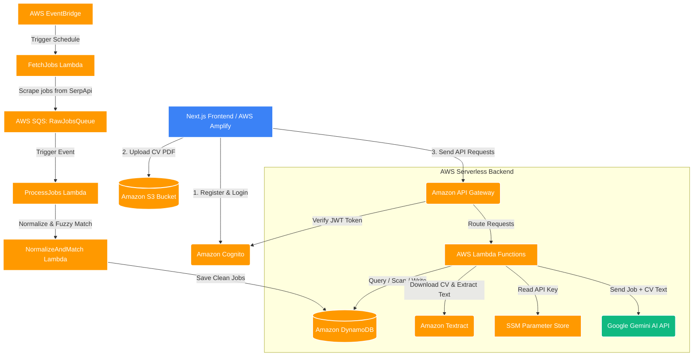

# AI Job Matching Platform

Welcome to the AI Job Matching Platform - an intelligent job connection and evaluation platform that utilizes Artificial Intelligence (AI) to analyze candidate CVs against real-world job postings.

> [!IMPORTANT]
> **LIVE DEMO:**
> ## [**Link Demo Project (AWS Amplify)**](https://main.d11bs7h108pe40.amplifyapp.com)

---

## Project Overview

The AI Job Matching Platform solves recruitment and job-seeking challenges by automating job post ingestion, CV data extraction, and using a Large Language Model (LLM) to evaluate compatibility.

### Key Features
1. **Job Search & Filter**: Allows users to search through thousands of jobs ingested automatically from reputable recruitment sources via Google Jobs (SerpApi).
2. **CV Management**: Users can upload personal CVs (PDF format) to a secure cloud storage bucket.
3. **AI CV Matching & Analysis**:
   - Automatically extracts CV text using Optical Character Recognition (OCR).
   - Utilizes AI (Gemini) to score compatibility (Overall, Skills, Experience, Education).
   - Generates detailed insights on strengths, weaknesses, matched skills, missing skills, and actionable improvement suggestions.
4. **Favorites & History**: Saves candidate wishlist jobs and past CV matching evaluation records.
5. **User Authentication**: Secure sign-up, sign-in, and verification integrated with Cognito.

---

## Web Application Pages

The frontend application consists of the following key pages:
* **Home Page**: The main landing page introducing the platform's core benefits and capabilities.
* **Job Search Page**: Allows users to search, filter (by keyword, location, schedule type), and browse active job listings.
* **Upload CV Page**: Provides a drag-and-drop interface for users to upload their CVs in PDF format.
* **Job Matching Page**: Displays the AI evaluation results when matching a selected CV against a job description, including the matching score, strengths, weaknesses, and optimization suggestions.
* **Favorite Jobs Page**: Displays the list of bookmarked jobs that the user saved for future reference.

---

## System Architecture

Here is the general architecture showing how the frontend, AWS serverless backend, and AI models interact:



---

## Technology Stack

### **Frontend**
* **Framework**: Next.js (React, App Router)
* **Language**: TypeScript
* **Styling**: Tailwind CSS
* **SDK**: AWS Amplify SDK (for Cognito Auth & S3 Storage integration)

### **Backend (Serverless)**
* **Infrastructure as Code**: AWS SAM (Serverless Application Model) & CloudFormation
* **Runtime**: Node.js (TypeScript compiled via esbuild) & Python (for text normalization and deduplication services)
* **Task Scheduling**: AWS EventBridge & Amazon SQS
* **API Integration**: SerpApi (Google Jobs API)

### **AI/ML & OCR**
* **LLM**: Google Gemini (gemini-3.1-flash-lite) for semantic comparison and score evaluation.
* **OCR**: Amazon Textract for automated text extraction from uploaded PDF documents.

---

## Integrated AWS Services

The system is deployed on AWS utilizing a fully serverless model, optimizing resource efficiency and operational costs:

1. **Amazon API Gateway (HTTP API)**: Acts as the HTTP entry point routing client requests to backend Lambda functions, secured using a Cognito JWT Authorizer.
2. **AWS Lambda**: Runs backend business logic and handles periodic crawler/ingestion background processes.
3. **Amazon DynamoDB**: Stores job details, candidate wishlists, CV metadata, and AI evaluation results with single-digit millisecond latency.
4. **Amazon Cognito**: Handles user authentication, registration, email OTP confirmation, and issues secure JWT tokens.
5. **Amazon S3**: Securely stores CV documents uploaded as PDF files.
6. **Amazon SQS**: Handles raw job ingestion queues (RawJobsQueue) and error handling (RawJobsDLQ) asynchronously.
7. **Amazon Textract**: Automatically processes OCR text extraction from PDFs in S3 without managing servers.
8. **AWS Systems Manager (SSM) Parameter Store**: Stores sensitive API credentials (such as the Gemini API Key) as SecureStrings.
9. **AWS EventBridge**: Triggers background crawler Lambda functions periodically.
10. **AWS Amplify**: Hosts the Next.js frontend with automated Git-based CI/CD pipelines.

---

## Project Folder Structure

The project is structured as a monorepo separating frontend client and serverless backend code:

```txt
JOBS-MATCHING-PLATFORM/
├── frontend/                     # Frontend Application (Next.js)
│   ├── public/                   # Static assets (images, logos)
│   └── src/
│       ├── app/                  # Route definitions, pages, and layouts
│       ├── components/           # Reusable UI components (Navbar, Button, Modal...)
│       ├── features/             # Key feature modules (auth, jobs, matching, favorites)
│       │   ├── auth/             # Login, Register, Cognito Service logic
│       │   └── jobs/             # Job listings, Search bar, Job details
│       └── lib/                  # Shared API client, constants, and helper utilities
│
├── backend/                      # Serverless Backend (AWS SAM)
│   ├── template.yaml             # CloudFormation template configuring all AWS resources
│   ├── events/                   # Mock JSON events for testing Lambdas locally
│   └── src/
│       ├── functions/            # AWS Lambda entrypoints (TypeScript & Python)
│       │   ├── jobs/             # Search APIs and data crawler functions
│       │   ├── cv/               # CV Upload, extraction, and evaluation APIs
│       │   └── favorites/        # Wishlist management APIs (Save/Remove favorite jobs)
│       ├── services/             # Core business logic layer
│       ├── repositories/         # Database wrapper for DynamoDB Tables
│       └── utils/                # HTTP responses and global error handling helpers
│
└── docs/                         # Detailed project documentation and guides
```

For more details on code conventions, please refer to the [Project Folder Guide](file://Jobs-Matching-Platform/docs/project-folder-guide.md).
