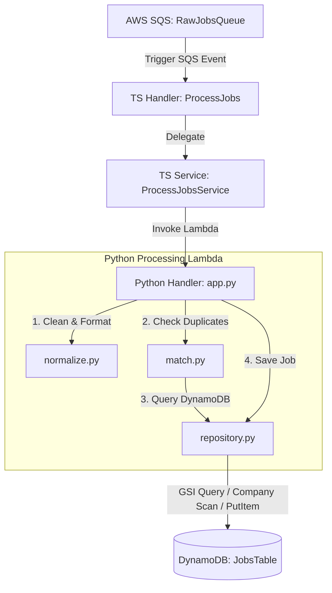

# Normalize and Matching Pipeline

This document describes the job ingestion, normalization, and deduplication pipeline added to the **AI Jobs Matching Platform** backend.

---

## 1. Overview & Workflow

The pipeline runs as a serverless ingestion workflow triggered by incoming job postings.



---

## 2. File Structure

```text
backend/
├── template.yaml                  # SAM configuration registering Lambda resources
├── src/
│   ├── functions/
│   │   ├── processJobs/
│   │   │   └── handler.ts         # TypeScript Lambda entrypoint (orchestrator)
│   │   └── normalizeAndMatch/
│   │       ├── app.py             # Python Lambda entrypoint (orchestrator)
│   │       ├── normalize.py       # Text/Date normalization library
│   │       ├── match.py           # Deduplication algorithms (exact & fuzzy matching)
│   │       └── repository.py      # JobRepository class for DynamoDB database calls
│   └── services/
│       └── processJobsService.ts  # TypeScript service handling SQS parsing and lambda invocation
```

---

## 3. Component Details & Function Definitions

### A. TypeScript Layer (SQS Consumer)

#### `src/functions/processJobs/handler.ts` (Orchestrator)
- **Role**: Entrypoint triggered by AWS SQS events.
- **Workflow**: Reads environment configurations, instantiates `ProcessJobsService`, and delegates processing.

#### `src/services/processJobsService.ts` (Service)
- **Role**: Contains SQS batch parsing business logic.
- **Functions**:
  - `processSQSEvent(event: SQSEvent, normalizeMatchFunctionName: string)`:
    - Loops through batch records, parses raw job payloads, and invokes the Python processor Lambda.
    - Propagates execution failures back to SQS for automatic retry/DLQ handling.

---

### B. Python Layer (Processor & Database)

#### `src/functions/normalizeAndMatch/app.py` (Orchestrator)
- **Role**: Synchronously invoked by the TS service. Coordinates normalization, deduplication, and database insertion.
- **Workflow**:
  1. Validates event payload (rejects messages missing `title` or `company_name`).
  2. Calls `normalize.py` to format titles and dates.
  3. Checks exact-hash duplicates and fuzzy-similarity duplicates via `match.py`.
  4. Calls `repository.py` to insert unique job records.

#### `src/functions/normalizeAndMatch/normalize.py` (Helper)
- **Functions**:
  - `normalize_title(title: str) -> str`:
    - Converts to lowercase.
    - Strips location tags and content inside brackets/parentheses (e.g. `[HCM]`, `(Junior)`, `(.NET)`).
    - Removes seniority levels and noise descriptors (`senior`, `junior`, `fresher`, `intern`, `tuyển`, `gấp`, `hn`, `hcm`).
    - Standardizes synonyms (e.g., `back-end` -> `backend`, `engineer` -> `developer`).
  - `normalize_posted_at(posted_at_str: str) -> str`:
    - Parses relative date descriptions (in both English and Vietnamese, e.g. `"4 ngày trước"`, `"yesterday"`).
    - Calculates the estimated posting date in `YYYY-MM-DD` format relative to UTC now.

#### `src/functions/normalizeAndMatch/match.py` (Deduplication)
- **Functions**:
  - `check_exact_duplicate(sha256_hash: str, repository: JobRepository) -> bool`:
    - Queries the database using `HashIndex` GSI for the given SHA-256 hash.
  - `check_fuzzy_duplicate(normalized_title: str, company_name: str, location: str, repository: JobRepository) -> dict`:
    - Scans DynamoDB filtered by the exact `companyName` to get matching company candidate jobs.
    - Compares `title + company_name + location` using `difflib.SequenceMatcher`.
    - Returns `is_duplicate=True` if similarity score is greater than `80%` (`> 0.8`).

#### `src/functions/normalizeAndMatch/repository.py` (Repository Pattern)
- **Class `JobRepository`**:
  - Encapsulates connection and table calls for `JobsTable`.
  - **Methods**:
    - `find_by_hash(sha256_hash: str) -> list`: Queries the `HashIndex` GSI.
    - `find_by_company(company_name: str) -> list`: Scans the table using `companyName` filter.
    - `insert(job_item: dict) -> None`: Puts the normalized item.
