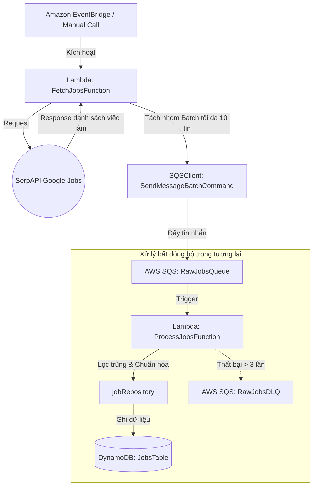

# BÁO CÁO PHÂN TÍCH HỆ THỐNG & CẤU TRÚC DỰ ÁN (REPORT SNAPSHOT)
*Dự án: AI Jobs Matching Platform*
*Ngày cập nhật: 13-06-2026*

---

## 1. TỔNG QUAN DỰ ÁN & MỤC TIÊU HỆ THỐNG
Dự án **AI Jobs Matching Platform** (Nền tảng đối khớp việc làm thông minh bằng AI) là một hệ thống được xây dựng trên kiến trúc lai (Hybrid):
- **Frontend:** Ứng dụng Web Single Page phát triển bằng Next.js (v16.2.7), React v19, TypeScript và Tailwind CSS v4, triển khai trên AWS Amplify.
- **Backend:** Xây dựng theo mô hình Serverless sử dụng kiến trúc AWS SAM (Serverless Application Model), ngôn ngữ Node.js (v24.x) và TypeScript.
- **Hệ thống hàng đợi (Message Queue):** Sử dụng AWS SQS để bất đồng bộ hóa luồng thu thập dữ liệu (Ingestion Flow), giảm tải hệ thống và tăng tính chịu lỗi.
- **AI/ML:** Sử dụng Amazon Textract trích xuất CV và Amazon Bedrock để đánh giá mức độ trùng khớp.

---

## 2. PHÂN TÍCH CẤU HÌNH AWS SAM (`template.yaml`)
Tệp tin [template.yaml](file:///d:/code/FCAJ/JobAggerator/Jobs-Matching-Platform/backend/template.yaml) đã được cập nhật đáng kể với việc bổ sung hạ tầng hàng đợi và cấu hình đóng gói Lambda.

### 2.1. Phân tích tham số (Parameters) & Cải tiến Bảo mật
Hệ thống đã loại bỏ việc hardcode các thông tin nhạy cảm trong cấu hình:
- **`SerpApiKey`**: Đã chuyển đổi sang dạng tham chiếu đến **SSM Parameter Store** (`/jobs-matching/dev/serpapi-key`). Thiết lập này giúp bảo vệ mã nguồn, tuân thủ nguyên tắc DevSecOps bảo mật khóa API.
- **`StageName` & `ProjectName`**: Tiếp tục được dùng để định danh tài nguyên theo môi trường và tiền tố dự án.

### 2.2. Tài nguyên hạ tầng vừa được thêm mới (Resources)
1. **`RawJobsDLQ` (AWS::SQS::Queue):**
   - Hàng đợi tin nhắn lỗi (Dead Letter Queue) dành cho các job không thể xử lý sau nhiều lần thử lại.
   - Thời gian lưu trữ tin nhắn: `14 ngày` (`1209600` giây), giúp đội ngũ vận hành có thời gian kiểm tra và xử lý lỗi thủ công.
2. **`RawJobsQueue` (AWS::SQS::Queue):**
   - Hàng đợi chứa thông tin việc làm thô thu thập được từ SerpAPI.
   - `VisibilityTimeout: 60` giây (thời gian ẩn tin nhắn khi có Lambda đang xử lý). Thời gian này phù hợp vì lớn hơn Timeout của Lambda (30 giây) giúp tránh xử lý trùng lặp.
   - Cấu hình `RedrivePolicy`: Chuyển tiếp tin nhắn sang `RawJobsDLQ` nếu xử lý thất bại quá `3` lần (`maxReceiveCount: 3`).
3. **`FetchJobsFunction` (AWS::Serverless::Function):**
   - Lambda thực hiện thu thập dữ liệu.
   - Cấp quyền gửi tin nhắn đến SQS qua chính sách bảo mật tối giản: `SQSSendMessagePolicy`.
   - Biến môi trường được cấu hình động: `QUEUE_URL` (tham chiếu đến `RawJobsQueue`) và `SERPAPI_KEY` (tham chiếu đến `SerpApiKey`).
   - **Đóng gói dự án (Metadata esbuild):** Sử dụng `esbuild` làm công cụ đóng gói (bundler) với các tùy chọn: tối giản hóa code (`Minify: true`), target Javascript `es2020` và tạo tệp bản đồ nguồn (`Sourcemap: true`) để phục vụ debug.

### 2.3. Các Tài nguyên Còn thiếu trong Tương lai (Cần bổ sung tiếp)
Mặc dù đã có luồng Ingestion hàng đợi, backend vẫn cần định nghĩa thêm các tài nguyên khác:
- **`JobsTable`**: Bảng DynamoDB lưu tin tuyển dụng chính thức sau khi làm sạch.
- **`ProcessJobsFunction`**: Lambda lắng nghe hàng đợi `RawJobsQueue`, tiến hành làm sạch, chuẩn hóa dữ liệu việc làm và lưu vào bảng `JobsTable`.
- **`FavoritesTable` & `MatchResultTable`**: Các bảng DynamoDB lưu dữ liệu người dùng yêu thích và lịch sử so khớp CV.
- **`CvBucket`**: S3 Bucket lưu file CV của ứng viên.
- **`EvaluateMatchingFunction`**: Lambda xử lý AI kết nối Bedrock và Textract.

---

## 3. PHÂN TÍCH CẤU TRÚC MÃ NGUỒN & BIẾN ĐỔI LOGIC

### 3.1. Trạng thái Triển khai Logic ở Backend
Hiện tại, logic của phân vùng 1 (Jobs Ingestion) đã có mã nguồn hoạt động thay vì chỉ là các placeholder trống:

- **Entry Point: [handler.ts](file:///d:/code/FCAJ/JobAggerator/Jobs-Matching-Platform/backend/src/functions/fetchJobs/handler.ts)**
  - Nhận tham số tìm kiếm từ `event` đầu vào (mặc định query: `"Backend Developer"`, location: `"Ho Chi Minh City, Vietnam"`).
  - Đọc biến môi trường và kiểm tra sự tồn tại của `QUEUE_URL` và `SERPAPI_KEY`.
  - Gọi tầng Service để lấy dữ liệu tuyển dụng từ API và đưa vào hàng đợi SQS.
- **Service Layer: [jobService.ts](file:///d:/code/FCAJ/JobAggerator/Jobs-Matching-Platform/backend/src/services/jobService.ts)**
  - **`fetchJobsFromSerpApi`**: Thực hiện request HTTP GET tới SerpAPI bằng `fetch` của Node.js, truyền đầy đủ tham số tìm kiếm ngôn ngữ (`hl: vi`, `gl: vn`).
  - **`pushJobsToSQS`**: Đưa dữ liệu danh sách công việc nhận được vào hàng đợi AWS SQS.
    - Để tối ưu hóa hiệu năng mạng và chi phí AWS, hàm triển khai cơ chế **gửi hàng loạt (Batching)** với kích thước `batchSize = 10` (giới hạn tối đa của SQS) bằng cách gọi `SendMessageBatchCommand` của `@aws-sdk/client-sqs`.
    - Gán UUID định danh duy nhất làm `Id` cho từng tin nhắn trong lô.

---

## 4. CHI TIẾT LUỒNG DỮ LIỆU CẬP NHẬT (UPDATED CODE FLOW)

### Luồng Ingestion Bất đồng bộ với AWS SQS (Asynchronous Ingestion Flow)
Nhờ việc tích hợp SQS, luồng xử lý thu thập dữ liệu đã được tách biệt làm 2 phân vùng độc lập giúp nâng cao tính ổn định hệ thống:

1. **Đồng bộ thô (Nhánh sản xuất tin nhắn - Producer):**
   - Lambda `FetchJobsFunction` lấy thông tin thô từ SerpAPI.
   - Dữ liệu thô không được xử lý ngay mà được đẩy xuống hàng đợi `RawJobsQueue` dưới dạng tin nhắn JSON theo từng nhóm 10 tin.
2. **Xử lý thô (Nhánh tiêu thụ tin nhắn - Consumer - Kế hoạch):**
   - Hàng đợi SQS sẽ trigger một Lambda chuyên biệt (`ProcessJobsFunction`).
   - Lambda này xử lý tuần tự hoặc song song các tin tuyển dụng thô, chuẩn hóa thông tin và lưu vào DynamoDB.
   - Nếu xảy ra lỗi hệ thống (ví dụ: DynamoDB bị quá tải ghi), tin nhắn sẽ được giữ lại SQS để retry. Sau 3 lần thất bại liên tiếp, tin nhắn chuyển vào `RawJobsDLQ` để giám sát lỗi.

---

## 5. THAY ĐỔI CẤU HÌNH DEPLOY (`samconfig.toml`)
Tệp [samconfig.toml](file:///d:/code/FCAJ/JobAggerator/Jobs-Matching-Platform/backend/samconfig.toml) quản lý cấu hình deploy AWS SAM có sự cập nhật:
- **`stack_name` & `s3_prefix`**: Cấu hình tên stack là `sam-app` thay vì `job-matching`.
- **`parameter_overrides`**: Giá trị tham số `SerpApiKey` được chỉ định là đường dẫn SSM `/jobs-matching/dev/serpapi-key`. Khi chạy lệnh `sam deploy`, AWS SAM sẽ tự động phân giải đường dẫn này trên AWS Systems Manager để lấy API Key thực thi mà không làm lộ khóa bí mật trong mã nguồn hay các tệp cấu hình git.

---

## 6. CÁC BƯỚC THỰC THI TIẾP THEO

1. **Tạo SSM Parameter trên Cloud hoặc Local Mock:**
   - Cần đảm bảo tham số `/jobs-matching/dev/serpapi-key` tồn tại trên AWS Systems Manager Parameter Store tại vùng `ap-southeast-1` trước khi deploy dự án.
2. **Xây dựng Consumer Lambda (`ProcessJobsFunction`):**
   - Tạo mới thư mục `backend/src/functions/processJobs` và cài đặt trigger SQS trong `template.yaml`.
3. **Phát triển Repository Ghi Database:**
   - Hiện thực hóa lớp `jobRepository.ts` sử dụng `@aws-sdk/client-dynamodb` để thực hiện thao tác kiểm tra trùng lặp và ghi dữ liệu việc làm.
